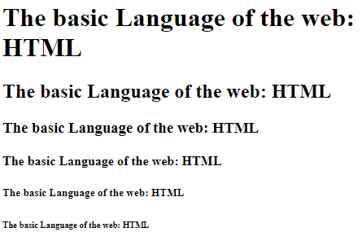

# Intro to HTML

**HTML** -> Hyper Text Markup Language  
It is used to describe the content of a webpage (not a _programming language_)

An element is made up of three parts

- opening tag
- content of the element
- closing tag

# HTML Document structure

All HTML files require a html, body and head tag
Elements in the head tag will not necessarily be shown to the user

# Text elements

There are six "h" tags -> h1 to h6  
Headings are used to break up text into logical sections

"p" tags are used to write more generic smaller text

A good practice is to only ever have **one** h1 tag in each html page

You can use "b" tags to create bold text however it is deprecated and the "strong" tag should be used instead as it has no **semantic** meaning

The same goes for the "i" tag (italics). Use "em" (emphasise) instead
