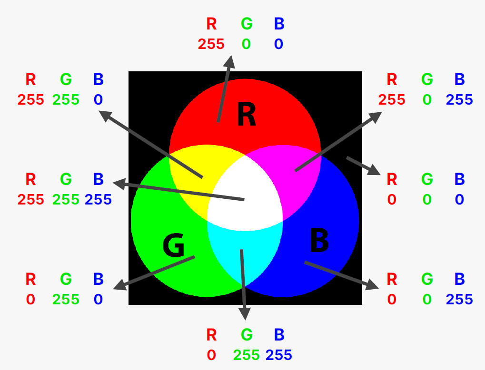

# Intro to CSS

CSS means **C**ascading **S**tyle **S**heets  
It describes the visual style and presentation of the content within HTML

There are a lot of properties which let you change the way elements look and are layed out

**YOU DO NOT NEED TO LEARN THEM ALL**

# Inline, Internal and External CSS

### **Inline CSS**

CSS code written inside the HTML element  
**SHOUlD NEVER BE USED**

### **Internal CSS**

This comes in the form of a "style" element inside the head  
Everything inside this element is CSS syntax

Better than inline styling but still not recommended for large style sheets -> seperation of concerns

### **External CSS**

Usually the best path to take as everything is nicely organised

Use the "link" element with the "href" and "rel" attributes to define the location of the css file (href) and the type of link this is (rel)

# Styling text

6 properties which let you style text:

- font-size: changes the size of the font. By default the font-size is 16px
- font-family: Different fonts for text
- text-transform: Change text to a different case (upper case, lower case etc)
- font-style: The style of the text (bold, italics etc)
- text-align: How the text is aligned relative to its parent element
- line-height: Space between each line of text

Other properties:

- font-weight: lets you make text bold

# Combining selectors

Makes the CSS file less repetetive and improves maintainability of styling

Descendant selectors select child elements

Not the most recommended way to do this as it is not maintainable

# Class and ID selectors

IDs are special attributes on HTML elements which can be selected inside CSS using the hash (#) selector

The big difference between classes and IDs is that each ID name is only allowed to be used once. However multiple elements can have the same class names

If the class name has a space it should seperated with a dash

Select classes using the dot (.) selector

Classes are most of the time better than IDs and should be used more as it makes your code more prepared for the future and will prevent unnecessary bugs

**Extra styling property**

- list-style: none; -> Removes bullet points from unordered lists

# Working with colors

Different ways to represent colours in CSS

## **RGB MODEL**

- Every color is represented with a combination of red, green, blue
- Each of the 3 base colours take a value between 0 and 255

### RGB notation

- rgb(0, 255, 255) - regular
- rgba(0, 255, 255, 0.3) - with transparency ("alpha")

### Hexadecimal notation

- scale from 0 to ff - (255 in hexadecimal)
- #00**ff**_ff_
- shorthand - #0**f**_f_ -> When the colors have identical pairs

In practice hexadecimal is mostly used and rgba used for transparency

## CSS color properties

- color - Lets you change the color of an element in hexadecimal or rgb form
- background-color - Changes the background color of an element
- border - Takes in 3 values (size, style, color)
- border-top/bottom/left/right - Border at specific sides of the element

# Pseudo-classes

To select the first element of any list you can do this:

`li:first-child`

This will select all the first list elements in any lists

This selects the first child of the element and not the first occurence of that element

Works the same for `last-child`
